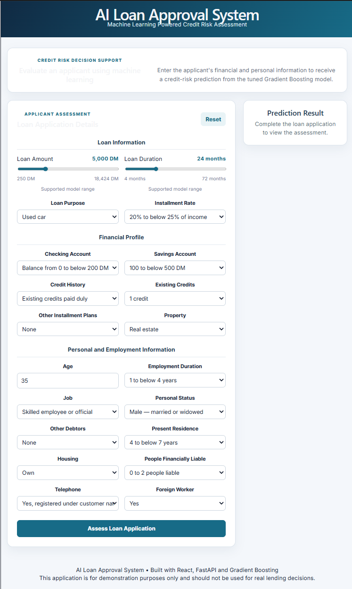
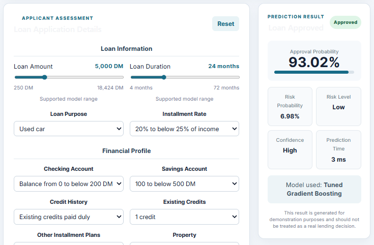
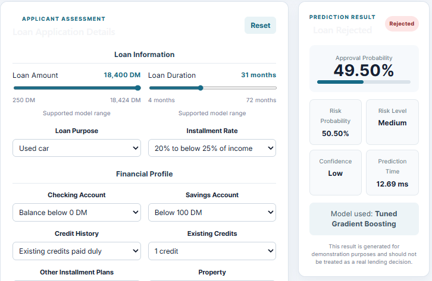
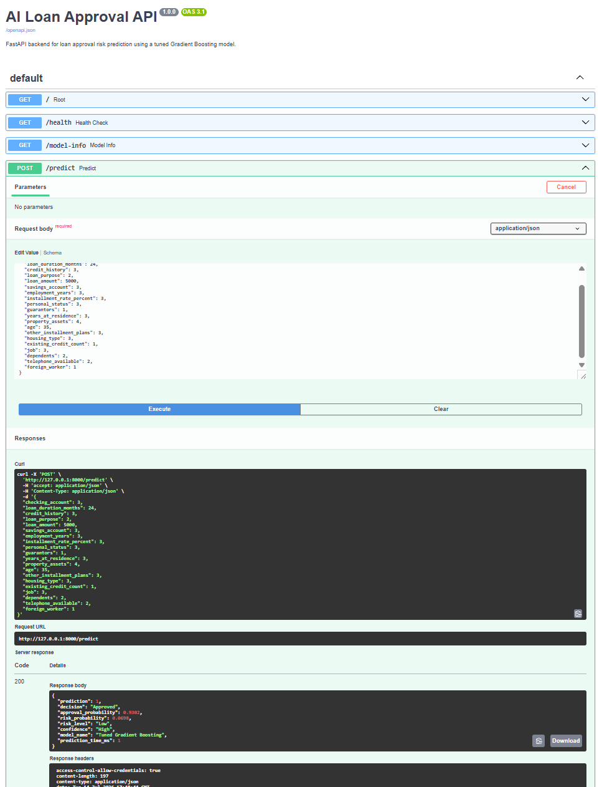
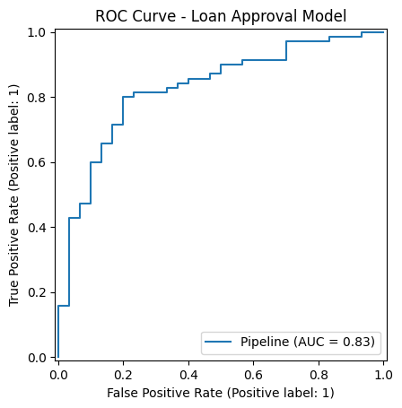
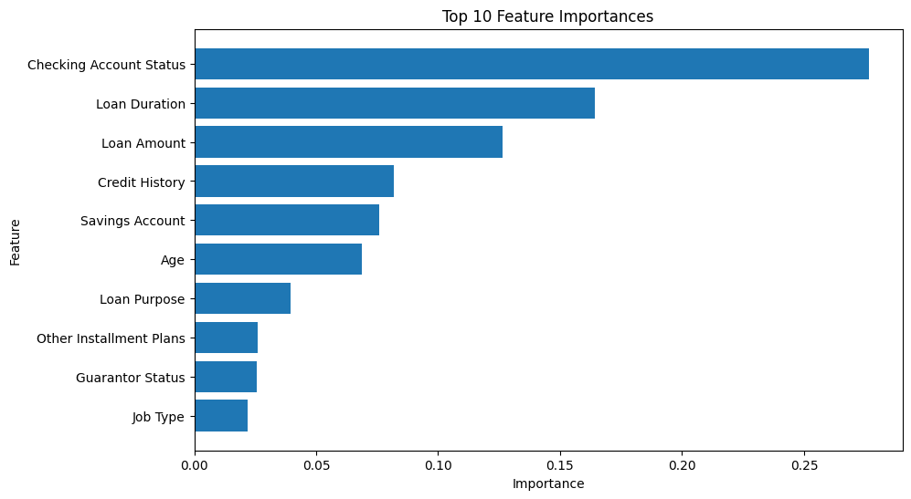

# AI Loan Approval System

An end-to-end machine learning web application that predicts whether a loan application should be approved or rejected using a **Gradient Boosting Classifier**.

The project combines **Machine Learning**, **FastAPI**, and **React** to simulate a real-world loan approval workflow. Users enter applicant details through a modern web interface, and the application returns an instant prediction along with approval probability, risk level, confidence score, and model inference time.

> **Disclaimer**
>
> This project is built for educational and portfolio purposes only. It is **not** intended for real financial or lending decisions.

---

# Demo

## Application



---

## Approved Loan Prediction



---

## Rejected Loan Prediction



---

## FastAPI API Documentation



---

## Model ROC Curve



---

## Feature Importance



### Features

- Predict loan approval using Machine Learning
- Interactive React frontend
- FastAPI REST API backend
- Real-time prediction
- Approval probability
- Risk probability
- Risk level
- Model confidence
- Prediction latency
- Input validation
- Responsive UI

---

# Tech Stack

### Frontend

- React
- Vite
- JavaScript
- CSS

### Backend

- FastAPI
- Uvicorn
- Pydantic

### Machine Learning

- Scikit-learn
- Gradient Boosting Classifier
- Pandas
- NumPy
- Joblib
- Matplotlib

---

# Project Architecture

```
                React Frontend
                       │
                       │ REST API
                       ▼
                FastAPI Backend
                       │
                       ▼
        Tuned Gradient Boosting Model
                       │
                       ▼
              Loan Approval Prediction
```

---

# Project Structure

```
ai-loan-approval-system/

├── api/
│   └── main.py
│
├── data/
│   └── loan_data.csv
│
├── frontend/
│
├── models/
│   ├── tuned_gradient_boosting.pkl
│   ├── model_metadata.json
│   ├── feature_importance.csv
│   ├── feature_importance.png
│   └── roc_curve.png
│
├── src/
│   ├── config.py
│   ├── preprocessing.py
│   ├── training.py
│   ├── evaluation.py
│   ├── predictor.py
│   ├── schemas.py
│   └── train_model.py
│
├── requirements.txt
└── README.md
```

---

# Machine Learning Pipeline

1. Load dataset
2. Data preprocessing
3. 80/10/10 train-validation-test split
4. Baseline model comparison
5. Hyperparameter tuning
6. Model evaluation
7. Save trained model
8. Deploy model through FastAPI

---

# Model Performance

| Metric | Score |
|---|---:|
| Accuracy | **78.00%** |
| Precision | **76.99%** |
| Recall | **78.00%** |
| F1 Score | **76.96%** |
| ROC-AUC | **82.76%** |

The final deployed model is a **Tuned Gradient Boosting Classifier** selected after comparing multiple baseline machine learning algorithms.

---

# API Endpoints

| Method | Endpoint | Description |
|---------|-----------|------------|
| GET | `/` | API Status |
| GET | `/health` | Health Check |
| GET | `/model-info` | Model Information |
| POST | `/predict` | Loan Prediction |

---

# Installation

## Clone Repository

```bash
git clone <repository-url>

cd ai-loan-approval-system
```

---

## Backend

```bash
pip install -r requirements.txt
```

Run the API

```bash
python -m uvicorn api.main:app --reload
```

---

## Frontend

```bash
cd frontend

npm install

npm run dev
```

---

# Dataset

This project uses the **German Credit Dataset** from Kaggle.

The dataset contains applicant financial information such as:

- Checking account status
- Credit history
- Loan purpose
- Loan amount
- Savings account
- Employment duration
- Age
- Housing
- Existing credits
- Job category

---

# Future Improvements

- Explainable AI (SHAP)
- LLM-powered loan decision explanations
- AI Loan Underwriting Assistant
- Docker containerization
- Cloud deployment
- CI/CD pipeline
- User authentication
- Prediction history
- Model monitoring

---

# Author

**Jay Kondapalli**

MS Computer Science

University of North Carolina at Charlotte
